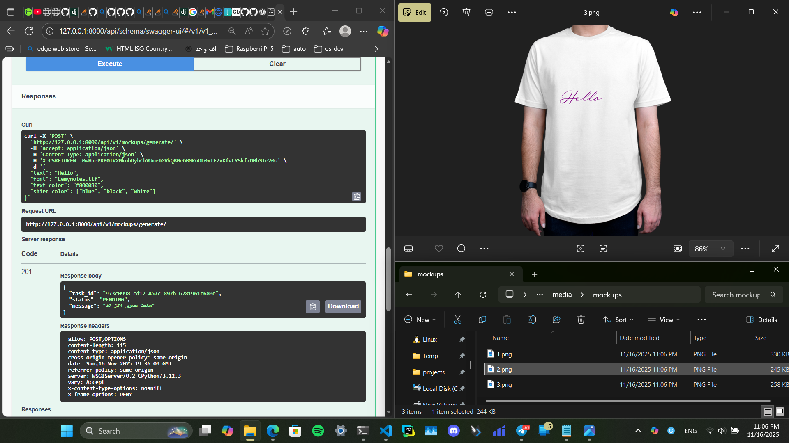

# پروژه ساخت Mockup تی‌شرت

این پروژه یک API مبتنی بر **Django REST Framework** است که امکان ساخت موکاپ‌ تی‌شرت با متن، فونت، اندازه و رنگ دلخواه را فراهم می‌کند.  
تصاویر نهایی به صورت **Async** توسط **Celery** پردازش شده و در مسیر `media/mockups` ذخیره می‌شوند.

این پروژه مجهز به امکانات زیر است:

- احراز هویت JWT  
- Celery و Redis برای پردازش پس‌زمینه  
- مستندات API با **drf-spectacular (Swagger UI)**  
- (Unit Test)  
- Docker & Docker Compose  
- تولید تصویر با استفاده از Pillow 



---

## 🚀 امکانات

- تولید خودکار موکاپ تی‌شرت با متن دلخواه  
- انتخاب رنگ مناسب متن بر اساس روشنایی تی‌شرت  
- پشتیبانی از چند رنگ پیش‌فرض لباس  
- اجرای تسک‌ها به صورت Async با Celery  
- احراز هویت مبتنی بر JWT  
- مستندات کامل API  
- Unit Test 
- قابلیت اجرای کامل با Docker  

---

## 🐳 اجرای پروژه با Docker

```bash
docker compose up --build
```

سپس به آدرس زیر مراجعه کنید:

```
http://127.0.0.1:8000
```

مشخصات سوپر یوزر پیش‌فرض (در نسخه Docker):

- **username:** admin  
- **password:** password  

---

## 🧑‍💻 اجرای پروژه بدون Docker

### ساخت محیط مجازی و نصب وابستگی‌ها

```bash
python -m venv .venv
source .venv/bin/activate     # یا در ویندوز:  .venv\Scripts\activate
pip install -r requirements.txt
```

کتابخانه Pillow ممکن است نیازمند پیش‌نیازهای سیستمی باشد:  
https://hugovk-pillow.readthedocs.io/en/stable/installation.html#external-libraries

### اعمال مایگریشن‌ها

```bash
python manage.py makemigrations
python manage.py migrate
```

### ساخت کاربر admin

```bash
python manage.py createsuperuser
```

### اجرای Celery Worker

```bash
celery -A customic worker --loglevel=info
```

### اجرای سرور Django

```bash
python manage.py runserver
```

⚠️ **توجه:** سرویس Redis باید قبل از اجرای Celery فعال باشد.

---

## 📁 File Structure

```bash
├── Dockerfile
├── compose.yaml
├── manage.py
├── customic
│   ├── settings.py
│   ├── celery.py
│   └── urls.py
├── mockups_api
│   ├── models.py
│   ├── views.py
│   ├── tasks.py
│   ├── serializer.py
│   └── tests
├── static
│   ├── fonts
│   └── images
├── media
└── README.md
```

---

## 🧠 روند کار سیستم

### Celery Task — تابع `make_mockup_image`

- دریافت اطلاعات تسک از مدل `MockupTask`
- بارگذاری تصاویر تی‌شرت از مسیر `static/images`
- انتخاب فونت از مسیر `static/fonts`
- تعیین رنگ متن با بررسی روشنایی تصویر
- تعیین موقعیت تقریبی متن
- تولید تصویر با Pillow
- ذخیره اطلاعات خروجی در مدل `Mockup`
- به‌روزرسانی وضعیت تسک

---

## 🔐 احراز هویت (JWT)

Endpoints:

```
/api/token/          → دریافت توکن  
/api/token/refresh/  → رفرش توکن  
```

تنظیمات در `settings.py`:

```python
'DEFAULT_AUTHENTICATION_CLASSES': (
    'rest_framework_simplejwt.authentication.JWTAuthentication',
),
```

---

## 📘 مستندات API

Swagger UI قابل دسترس در:

```
/api/schema/swagger-ui/
```

---

## 🧪 تست‌ها

تست‌ها در مسیر `mockups_api/tests/` قرار دارند:

- تست مدل‌ها (TestCase)
- تست توابع پردازش تصویر (SimpleTestCase)

---

## 🐳 Docker

### compose.yaml

دارای ۳ سرویس اصلی:

1. وب‌سرور Django  
2. Redis  
3. Celery Worker  

### Dockerfile

- نصب پیش‌نیازهای Pillow  
- نصب کتابخانه‌ها  
- اجرای سرور Django  

